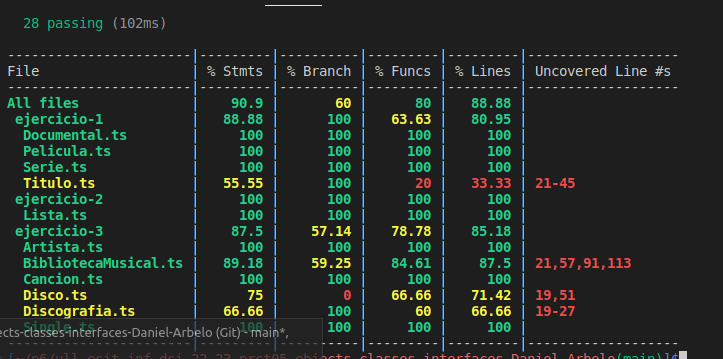

# Práctica 6 - Clases e interfaces genéricas. Principios SOLID

## Inroducción
En esta práctica tendremos que resolver una serie de ejercicios de programación que nos permitirán conocer más en profundidad las clases e interfaces genéricas del lenguaje TypeScript. Además, también deberán utilizar los principios SOLID de diseño orientado a objetos.

## Objetivos
El objetivo de la práctica es realizar los 3 ejercicios, cuyo código fuente debe estar en directorios independientes con nombre ejercicio-n/ dentro del directorio src/. También hay que utilizar TypeDoc para la documentación del código, asi como utilizar una metodología por pruebas TDD, en este caso se utilizará mocha y chai e implementar una nueva funcionalidad que es la de el cubrimiento del código con la herramienta instanbull y Coveralls.

## Ejercicio 1 - DSIflix
En primer lugar he definido una clase padre Titulo de la que derivan las clases Película, Documental y Serie, que tienen los datos de dicho título. Después se define la interfaz Stramable que contiene las funciones que tienen que implementar la clase abstracta BasicStreamableCollection de la que derivan las colecciones de películas, documentales y series que contienen arrays de Titulos, en concreto de la clase derivada. Por ejemplo ColeccionDocumentales tiene un array de Documentales.

## Ejercicio 2 - Implementación de una lista y sus operaciones
Se ha desarrollado una clase Lista la cual tiene un atributo que es un array genérico, para que se pueda inicializar la clase con diferente tipos de datos. Esta clase tiene una serie de métodos para realizar una serie de operaciones sobre este atributo.
El primero es append, que pasada otra lista la une al final de la lista a la que se le pasa.
```
append(lista2:Lista<T>){
        for(let i = 0; i < lista2.lenghth(); i++){
            this.push(lista2.getlista()[i]);
        }
}
```
También tiene la un método concatenate que es una funcion estática, que hace uso de append. Pasandole un numero variable se listas, las concaneta en orden.
```
static concatenate<T>(...listas:Lista<T>[]):Lista<T>{
        let sol = new Lista<T>();
        for(let lista of listas){
            sol.append(lista);
        }
        return sol;
}
```
El método filter, dada una funcion, aplica la función sobre cada elmento de la clase. Si cumple el predicado lógico de la función pasada, se añade a la solución y al terminar devolverá la nueva lista.
```
filter(funcion:(item:T) => boolean):Lista<T>{
        let sol:Lista<T> = new Lista<T>();
        for(let elemento of this.lista){
            if(funcion(elemento) == true){
                sol.push(elemento);
            }
        }
        return sol;
}
```
La funcion map aplica la funcion dada a cada elemento de la lista retorna una nueva lista resultado de haber pasado por la funcion.

```
map(transformar:(item:T)=> T):Lista<T>{
        let sol:Lista<T> = new Lista<T>();
        for(let elemento of this.lista){
            sol.push(transformar(elemento));
        }
        return sol;
}
```
La función reduce se le pasa una funcion con un un acumulador inicial reduce cada elemento utilizando la funcion pasada. Retorna el valor de aplicar la funcion pasada a la lista con el valor inicial del acumulador.
```
reduce(trnasformar:(acumulador:T, item:T) => T, valorInicial:T):T{
        let sol:T = valorInicial;
        for(let elemento of this.lista){
            sol = trnasformar(sol, elemento);
        }
        return sol;
}
```

Reverse devuelve la lista con los valores originales pero valores inversos recorre la lista al revez haciendo push de cada uno en una nueva lista.
```
reverse():Lista<T>{
        let sol = new Lista<T>();
        for(let i = (this.lenghth() - 1); i >=0; i--){
            sol.push(this.lista[i]);
        }
        return sol;
}
```
ForEach itera en los elemntos de la lista invocando la funcion pasada sobre ellos.
```
forEach(accion:(item:T) => void):void{
        for(let elemento of this.lista){
            accion(elemento);
        }
}
```

## Ejercicio 3 - Ampliando la biblioteca musical
En esta ejercicio hemos basicamente creado una clase llamada single, que se diferencia de disco en que simplemente en vez de tener una lista de canciones tiene una sola cancion.
después hemos creado otra clase, llamada discografía que contiene una lista de disco y singles, solo discos o solo singles.

```
class Discografia<T extends Disco, U extends Single>{
    constructor(private discografia:(T | U)[]){

    }

    getDiscografia(){
        return this.discografia;
    }
    
    addDiscoSingle(newElement:T | U){
        this.discografia.push(newElement);
    }

    getNumberOfElements(){
        return this.discografia.length;
    }

    getElement(index:number){
        return this.discografia[index];
    }

}
```
También tenemos que crear un método dentro de la clase para añadir disco o single, que con tiene un atributo que puede ser un disco o un single.
Ahora en la clase artista en vez de tener un atributo que es una lista de discos. Tendrá una instancia de la clase Discografía.
También hay que cambiar los métodos de búsqueda en la bibiliotecaMusical de busqueda por discografía y por cancion. Utilizando un guardian de tipos.
```
buscarPorDiscografia(nombre:string){
        let resultado:(Disco | Single)[]= [];
        this.artistas
        .forEach((artist) => {
            for(let i = 0; i < artist.discografia.getNumberOfElements(); i++){
                const myElement = artist.discografia.getElement(i);
                if(myElement instanceof Disco){
                    if(myElement.nombre == nombre)
                        resultado.push(myElement);
                }else if(myElement instanceof Single){
                    if(myElement.getNombre() == nombre)
                        resultado.push(myElement);
                }
            }
        })

        return resultado.map((elemento) => ({
            nombre: (elemento instanceof Disco? elemento.nombre: elemento.getNombre()),
            ano : (elemento instanceof Disco? elemento.ano: elemento.getAno()),
            numeroCannciones: (elemento instanceof Disco? elemento.getNumeroCanciones(): 1),
            duracion: (elemento instanceof Disco? elemento.getDuracion(): elemento.getCancion().duracion),
            reproducciones: (elemento instanceof Disco? elemento.getNumeroReproducciones(): elemento.getCancion().numeroReproducciones),
        }));
}
```
```
buscarPorCancion(nombre:string){
        let resultado:(Cancion)[]= [];
        this.artistas
        .forEach((artist) => {
            for(let i = 0; i < artist.discografia.getNumberOfElements(); i++){
                const myElement = artist.discografia.getElement(i);
                if(myElement instanceof Disco){
                    myElement.canciones.forEach(element => {
                        if(element.nombre == nombre){
                            resultado.push(element);
                        }
                    });
                }else if(myElement instanceof Single){
                    if(myElement.getCancion().nombre == nombre){
                        resultado.push(myElement.getCancion());
                    }
                }
            }
        })
        return resultado.map((cancion) =>({
            nombreCancion: cancion.nombre,
            duracion:cancion.duracion,
            generos: cancion.genero,
            single: cancion.single,
            reproducciones: cancion.numeroReproducciones,

        }));

        
}
```


## Cubrimiento del código
Cómo el repo es privado, no se puede añadir a coverall, pero se puede hacer el cubrimiento gracias al uso de 
```
nyc npm test
```

